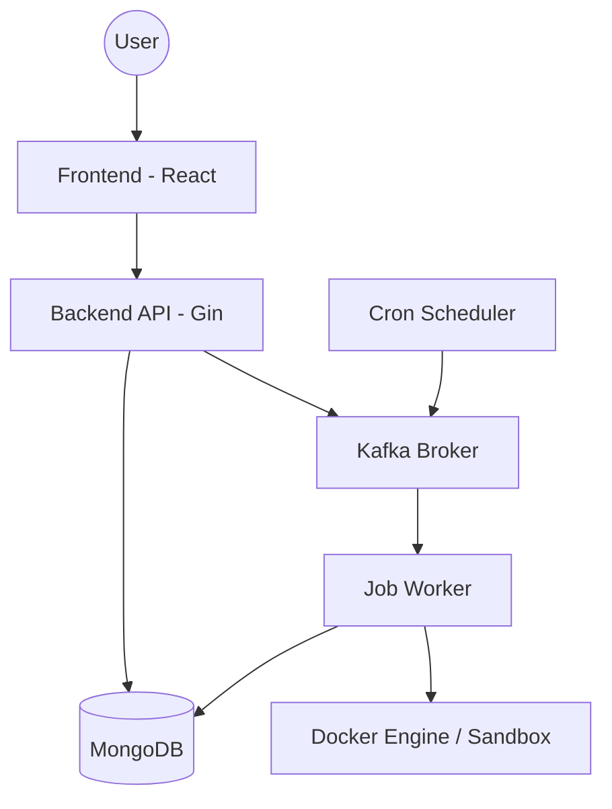

# Smart Task Orchestrator - Architecture Plan

## 1. System Overview
The Smart Task Orchestrator is a high-performance, scalable platform for executing and managing tasks in isolated environments. Use cases include AI sandboxes, code execution platforms (like LeetCode), and automated shell-based jobs.

## 2. Tech Stack
- **Backend**: Go (Gin Gonic, Mongo Driver, Kafka-go, Docker SDK)
- **Frontend**: React (Vite, CSS Modules/Modern CSS)
- **Database**: MongoDB (Persistence)
- **Message Broker**: Kafka (Task queue and event streaming)
- **Containerization**: Docker (Isolated job execution)
- **Authentication**: JWT (JSON Web Tokens) with Secure Password Hashing (bcrypt)

## 3. Architecture Diagram

## 4. Component Breakdown

### 4.1 Backend Services (Go)
- **API Server** (`/api`):
    - `AuthHandler`: Signup, Login, Password Reset, JWT issuing.
    - `UserHandler`: Profile management, API Key generation.
    - `JobHandler`: CRUD for job configurations.
    - `DashboardHandler`: Monitoring data aggregator.
- **Scheduler** (`/scheduler`):
    - Scans MongoDB for due Cron jobs.
    - Publishes task execution events to Kafka.
- **Worker** (`/worker`):
    - Consumes from Kafka.
    - Implements 3 execution strategies:
        1. **One-time**: Spawns container, runs command, destroys.
        2. **Cron**: Triggered by scheduler, same as one-time.
        3. **Sandbox**: Maintains a warm pool of containers (min/max), injects data (file/json/text), streams logs.
- **Logger**: Captures container logs and stores them for UI visibility.

### 4.2 Database Schema (MongoDB)
- **Users**: 
    - `_id`, `name`, `email`, `phone`, `password_hash`, `api_key`, `organization_id`.
- **Jobs**: 
    - `_id`, `user_id`, `name`, `type` (one-time, cron, sandbox), `config` (image, command, env), `cron_expression`, `scaling_config` (min, max).
- **Executions**: 
    - `_id`, `job_id`, `status` (queued, running, success, failed), `logs`, `started_at`, `ended_at`, `output_data`.

### 4.3 Frontend Pages (React)
- **Landing Page**: Premium marketing UI with vibrant colors and animations.
- **Dashboard**: Holistic monitoring with charts (Recharts) and real-time history.
- **Jobs**: UI for configuring One-time, Cron, and Sandbox jobs.
- **Profile**: Key management and user details.
- **Team**: Placeholder for organizational management.

## 5. Implementation Phases

### Phase 1: Foundation & Auth
- Project structure setup.
- MongoDB connection and User models.
- JWT Authentication & API Key generation.
- Basic Landing page and Auth UI.

### Phase 2: Job Orchestration core
- Kafka integration (Producer/Consumer).
- Docker SDK integration for job execution.
- Sandbox management logic (pool of containers).

### Phase 3: Dashboard & Monitoring
- Real-time logging streaming.
- Execution history visualization.
- Holistic monitoring metrics.

### Phase 4: Polish & Refinement
- Premium CSS/Aesthetics.
- Documentation and setup guides.

## 6. Security Considerations
- **Sandbox Isolation**: Containers run with limited resources and no privileged access.
- **API Security**: Rate limiting, JWT validation, and secure API Key storage.
- **Data Injection**: Validating all inputs before injecting into containers.
